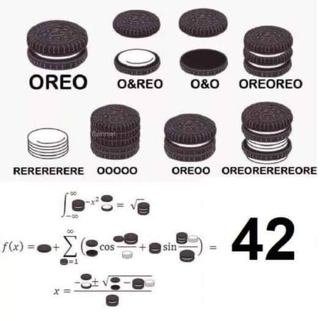

# Cool-Math
Some cool math problems i have solved with matlab 

## Gradient Descent for optimizing reactor (?yes it just works)

### From what you can see, we have some reactor. 
### Now we gradient it with optimization. 

### And we have maths optimized cool thanks 

